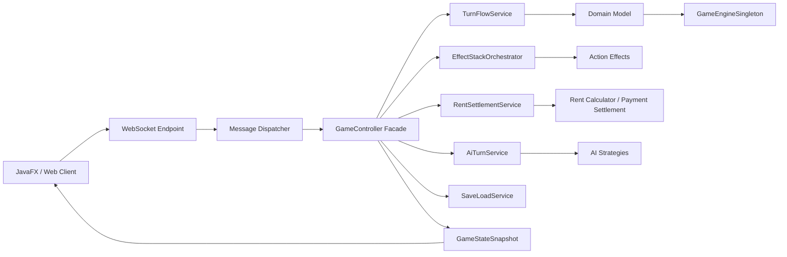

# Monopoly_Group7

## Project Completion Plan (Weeks 1-15)

Phase-1 due Week 8 (2026-04-22). Phase-2 due Week 15 (2026-06-09). Demo on 2026-06-11/12.

| Week | Key Milestones (focus shifts from analysis/UML in Weeks 1-8 to implementation/testing in Weeks 9-15) |
| --- | --- |
| 1 | Understand the game，project kickoff, requirement elicitation. |
| 2 | Design the schedule plan and complete the team division of labor , Elicit functional/non-functional requirements. |
| 3 | Elicit functional/non-functional requirements. |
| 4 | Discussion, understanding, learning, designing system architecture (MVC). |
| 5 | Design system architecture , Draft UML diagrams (Class, Sequence, Use Case). |
| 6 | Draft UML diagrams (Class, Sequence, Use Case). |
| 7 | Implement basic Model classes (Card, Player). |
| 8 | Finalize UML & Phase-1 PDF Report , Submit Phase-1 to Brightspace. |
| 9 | Implement GameController and TurnManager. |
| 10 | Apply Factory (Deck creation) and Strategy (AI logic) , Write JUnit test cases for game rules (e.g., Rent calculation). |
| 11 | Implement GameUpdateSubject (Observer Pattern). |
| 12 | Setup WebSocket/Network dispatchers , Connect Java Backend with JavaFX (FXML) desktop UI. |
| 13 | Refine AI difficulties (Easy/Hard) , Code refactoring to eliminate "Code Smells" (Ensure no large classes/methods). |
| 14 | End-to-end system testing. |
| 15 | Write Phase-2 final PDF explanation , Code freeze and final submission. |

## Member Contributions

| Name | Role | Primary Tasks | Contribution (%) |
| --- | --- | --- | --- |
| Liu Zongrun| Architectural Designer | The overall concept and structure of the design project | 20% |
| Lei Yurun| Graphic Design | Draw UML diagrams and organize group discussions | 20% |
| Wang Tingdong | Summary of Requirements |Summarize the requirements after the group discussion and prepare the requirements document | 20% |
| Qiu Siqi | Review and verification |Responsible for checking the compatibility between UML diagrams and the project | 20% |
| Liu Yuhao | Contact Assistance |Assist in summarizing the requirements document and reviewing the presentation document | 20% |

The contribution percentages differ because core code development (architecture, gameplay logic, GUI, design patterns) carries higher complexity and effort, while documentation and black-box testing require comparatively less specialized implementation work.

## Project Overview

This project implements **Monopoly Deal** as a Java-based multiplayer card game.
The system includes a WebSocket game server, a JavaFX/FXML desktop client, and an
optional Vue/Vite web client for browser-based interaction.

The implementation focuses on complete turn flow, card effects, rent settlement,
AI players, save/load support, and real-time state synchronization between clients.

## Key Features

- Multiplayer game sessions over WebSocket.
- JavaFX desktop client with card images and interactive action dialogs.
- Full Monopoly Deal card model: properties, wildcards, money, rent, and action cards.
- Turn lifecycle covering draw, play, response window, discard, and end turn.
- Action effects including Rent, Double Rent, Just Say No, Deal Breaker, Sly Deal,
  Forced Deal, House, Hotel, Birthday, Debt Collector, and Pass Go.
- AI players with multiple strategy profiles.
- Save/load support with optional AES-GCM encryption.
- JUnit coverage for rules, controller flow, persistence, network protocol, and AI behavior.

## System Architecture



## Repository Structure

| Path | Purpose |
| --- | --- |
| `backend/src/main/java/com/monopoly/controller/` | Game facade and turn-flow services. |
| `backend/src/main/java/com/monopoly/model/` | Core domain model: cards, players, effects, rules, and settlement. |
| `backend/src/main/java/com/monopoly/network/` | WebSocket server, session registry, and protocol routing. |
| `backend/src/main/java/com/monopoly/fx/` | JavaFX desktop client. |
| `backend/src/main/java/com/monopoly/pattern/` | Factory, Observer, Singleton, and Strategy pattern implementations. |
| `backend/src/main/java/com/monopoly/persistence/` | Save/load memento and encryption support. |
| `backend/src/test/java/com/monopoly/` | JUnit tests. |
| `frontend/` | Optional Vue/Vite web client. |
| `docs/` | Final reports and project reference documents. |

## Tech Stack

- Java 17
- Maven
- JavaFX + FXML
- Jakarta WebSocket / Tyrus
- Gson
- JUnit 5
- Vue 3 + Vite

## Quick Start

### Run Tests

```bash
mvn -q test
```

### Start WebSocket Server

```bash
mvn -q exec:java
```

Default endpoint:

```text
ws://localhost:8025/ws
```

### Start JavaFX Client

Run this after the server has started:

```bash
mvn javafx:run
```

### Build Web Client

```bash
npm run build --prefix frontend
```

## WebSocket Smoke Test

```bash
wscat -c ws://localhost:8025/ws
```

Send:

```json
{"type":"PING","payload":{}}
```

Start a demo session:

```json
{"type":"START_SESSION","payload":{"sessionId":"demo","playerCount":2,"gameMode":"PVP","randomizeFirstPlayer":false}}
```

Expected response includes `STATE_UPDATE`.

## Runtime Options

| JVM Flag | Default | Purpose |
| --- | --- | --- |
| `-Dmonopoly.verifyDeck=true` | `false` | Verifies deck/card-count consistency during development. |
| `-Dmonopoly.autosave=true` | `false` | Writes autosaves every 3 full rounds. |
| `-Dmonopoly.saveKey=...` | unset | Enables AES-GCM encrypted save files. |
| `-Dmonopoly.sessionLimitMs=...` | default constant | Overrides session timeout. |
| `-Dmonopoly.deck.seed=...` | unset | Makes deck shuffling deterministic. |
| `-Dmonopoly.firstPlayer.seed=...` | unset | Makes randomized first-player selection deterministic. |

## Documentation

- Project reference notes: [`docs/PROJECT_NOTES.txt`](docs/PROJECT_NOTES.txt)
- Phase 2 final report: [`docs/phase2-final-report-zh.pdf`](docs/phase2-final-report-zh.pdf)
- Original project brief: [`docs/Software Engineering Project - Game-26.pdf`](docs/Software%20Engineering%20Project%20-%20Game-26.pdf)
