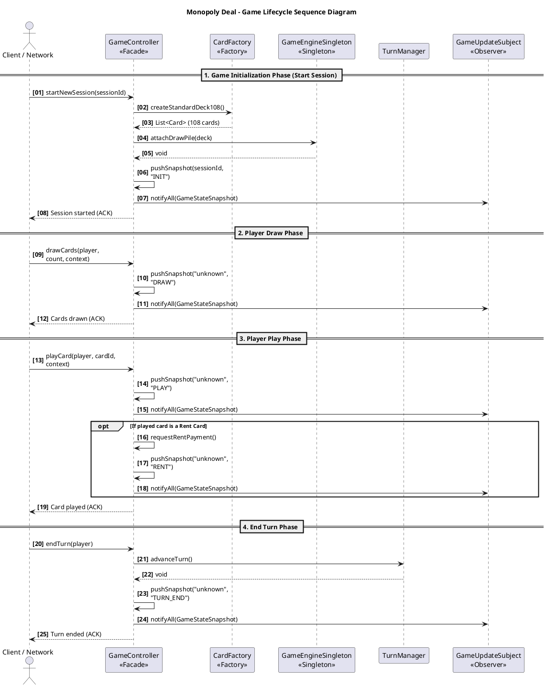
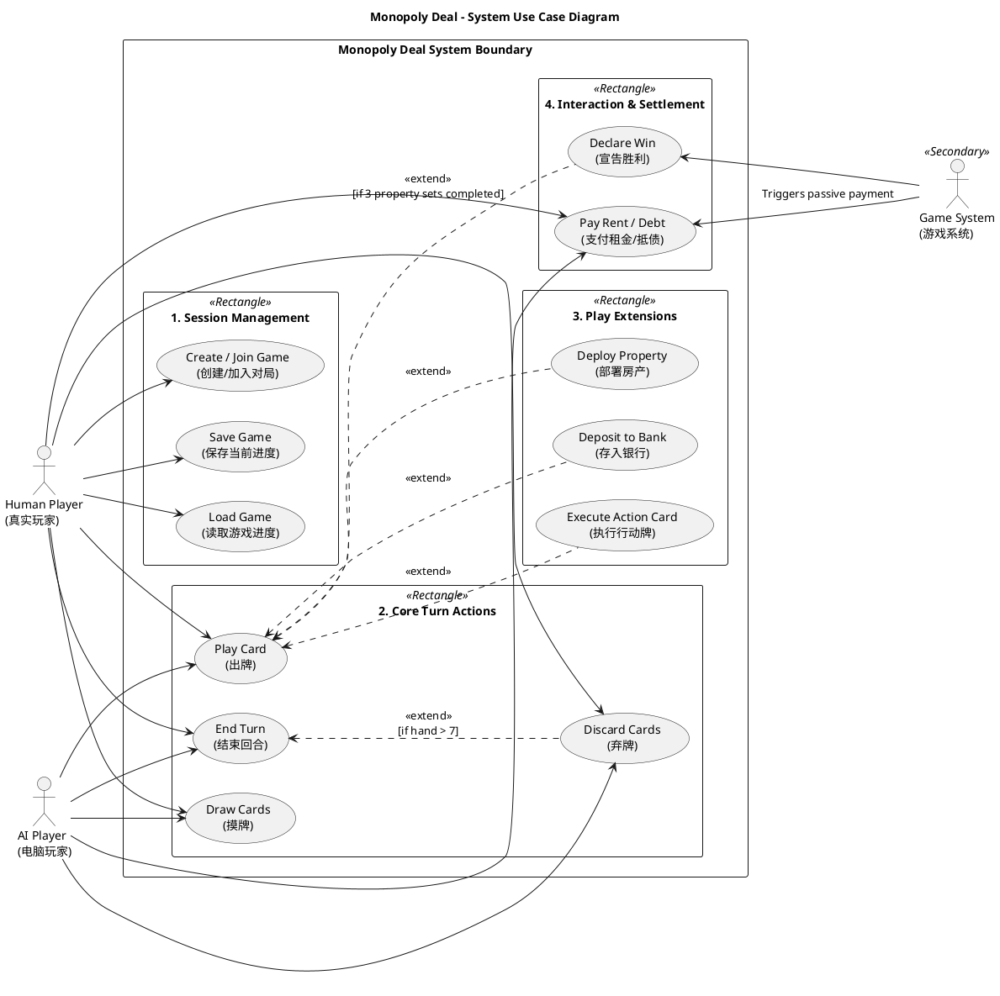

```plantuml
@startuml
skinparam classAttributeIconSize 0
skinparam linetype ortho
skinparam nodesep 60
skinparam ranksep 60
skinparam monochrome false
skinparam packageStyle rectangle

title Monopoly Deal Cards Game - Architecture Class Diagram

package "com.monopoly.model" #EBF4FA {
    interface Playable {
        + executeEffect(context: GameContext): void
    }
    interface Payable {
        + getFaceValue(): int
    }
    abstract class Card {
        - id: String
        - name: String
        - colorType: String
        + getId(): String
        + getName(): String
    }
    class PropertyCard extends Card implements Payable {
        - rentValues: int[]
        + getFaceValue(): int
    }
    class ActionCard extends Card implements Playable {
        - actionType: String
        + executeEffect(context: GameContext): void
    }
    abstract class Player {
        - playerId: String
        - handCards: List<Card>
        + drawCards(amount: int): void
        + playCard(card: Card): void
    }
    class HumanPlayer extends Player
    class AIPlayer extends Player
    class GameContext {
        - activePlayers: List<Player>
        - discardPile: List<Card>
        + getActivePlayers(): List<Player>
    }
}

package "com.monopoly.pattern" {
    package "strategy" #E8F8F5 {
        interface AiPlayStrategy {
            + determineNextMove(player: AIPlayer, context: GameContext): Card
        }
        class EasyAiPlayStrategy implements AiPlayStrategy
        class NormalAiPlayStrategy implements AiPlayStrategy
        class HardAiPlayStrategy implements AiPlayStrategy
    }
    AIPlayer *-- AiPlayStrategy : "uses >"
    package "factory" #FEF9E7 {
        interface CardFactory {
            + createStandardDeck(): List<Card>
        }
        class MonopolyDealCardFactory implements CardFactory
    }
    MonopolyDealCardFactory ..> Card : "<<creates>>"
    package "observer" #FDEDEC {
        interface GameUpdateObserver {
            + onGameStateUpdated(snapshot: GameStateSnapshot): void
        }
        interface GameUpdateSubject {
            + attach(obs: GameUpdateObserver): void
            + notifyAll(snapshot: GameStateSnapshot): void
        }
        class DefaultGameUpdateSubject implements GameUpdateSubject
    }
    DefaultGameUpdateSubject o-- GameUpdateObserver : "notifies >"
    package "singleton" #F5EEF8 {
        class GameEngineSingleton <<Singleton>> {
            - {static} instance: GameEngineSingleton
            + {static} getInstance(): GameEngineSingleton
        }
    }
}

package "com.monopoly.controller" #F4ECF7 {
    class TurnManager {
        - currentPlayerIndex: int
        + advanceTurn(): void
        + getCurrentPlayer(): Player
    }
    class GameController <<Facade>> {
        - turnManager: TurnManager
        - cardFactory: CardFactory
        - stateSubject: GameUpdateSubject
        + startNewSession(req): void
        + drawCards(player, count): void
        + playCard(player, card, actionType): void
        + endTurn(player): void
        + handlePlayActionRequest(req): void
    }
    class TurnFlowService <<package>> {
        - currentTurnPlayerId: String
        - currentTurnPhase: TurnPhase
        - currentTurnActionCount: int
        + drawCards(player, count): void
        + playCard(player, card, type, params): void
        + endTurn(player): Player
        + playActionCard(actor, card, ctx, params): ActionEffectResult
    }
    class EffectStackOrchestrator <<package>> {
        - responseScheduler: ScheduledExecutorService
        - pendingResponseFuture: ScheduledFuture
        + enterRentResponseWindow(tenant): void
        + performResponsePass(actingPlayerId): void
        + handleWaiverPlay(req): void
    }
    class AiTurnService <<package>> {
        + executeAiTurn(ai: AIPlayer): void
    }
    class RentSettlementService <<package>> {
        + requestRentPayment(from, to, amount, ctx): Result
        + collectRentForColor(landlord, tenant, colorKey): Result
    }
    class PauseVoteService <<package>> {
        - paused: boolean
        - pausePending: boolean
        + requestPause(): void
        + acknowledgePause(playerId): void
        + resume(): void
    }
    class SaveLoadService <<package>> {
        + exportSessionJson(): String
        + importSessionJson(json): void
        + maybeAutosaveAfterFullRound(rounds): void
    }
    class ProtocolErrors <<utility>> {
        + ERR_PLAY_REQUEST_EMPTY: String
        + ERR_PLAY_ACTION_TYPE_REQUIRED: String
    }
    GameController *-- TurnFlowService : "turn logic >"
    GameController *-- EffectStackOrchestrator : "effect stack >"
    GameController *-- AiTurnService : "AI turns >"
    GameController *-- RentSettlementService : "rent >"
    GameController *-- PauseVoteService : "pause >"
    GameController *-- SaveLoadService : "save/load >"
}

package "com.monopoly.dto" #FDEBD0 {
    class GameStateSnapshot
    class PlayActionRequest
    class StartSessionRequest
    class ActionParamContext
    class PropertyColorCount
}

package "com.monopoly.persistence" #D5F5E3 {
    class GameSessionMemento {
        + capture(controller): GameSessionMemento
        + applyToController(controller, memento): void
        + toJson(): String
        + {static} fromJson(json): GameSessionMemento
    }
    class SaveEncryption {
        + {static} encodeForStorage(json): String
        + {static} decodeFromStorage(encoded): String
    }
    class PersistedCard
    class SessionPlayerMemento
    class EffectStackEntryMemento
    class StackResponseStateMemento
}

package "com.monopoly.network" #FCF3CF {
    package "connection" {
        class ClientConnection
        class SessionRegistry
    }
    package "endpoint" {
        class MonopolyWebSocketEndpoint
        class WsServerMain
    }
    package "protocol" {
        class MessageDispatcher {
            + extractMessageType(json): String
            + parsePlayActionRequest(payload): PlayActionRequest
        }
    }
    class GameServer implements GameUpdateObserver {
        + onMessage(from, json): void
        + onClientConnected(client): void
    }
}

GameEngineSingleton *-- GameController
GameController *-- TurnManager : "composes >"
GameController --> DefaultGameUpdateSubject : "triggers >"
GameController --> CardFactory : "uses >"
GameServer *-- ClientConnection : "manages >"
GameServer --> MessageDispatcher : "routes msg >"
MessageDispatcher --> GameController : "calls API >"
SaveLoadService ..> GameSessionMemento : "uses >"
SaveLoadService ..> SaveEncryption : "uses >"
@enduml
```

# 架构与设计文档

本文档为仓库**架构资料的单一入口**：前半部分说明**目录树与各模块职责**；后半部分提供**类图 / 时序图 / 用例图**的 PlantUML 源码与导出图路径。实现与课程需求的偏差见 [`docs/implementation/requirement-trace-and-deviations.md`](../implementation/requirement-trace-and-deviations.md)。

---

## 第一部分：项目结构与模块职责

### 1. 核心目录树（Tree）

以下为仓库**核心**结构：`src`（Java 后端 + JavaFX/FXML 桌面客户端）、`docs`（文档）。

```text
Monopoly_Group7/
├── pom.xml                          # Maven：Java 17、JUnit、Gson、Jakarta WebSocket / Tyrus 等依赖
├── README.md
├── rules.md                         # Monopoly Deal 纸牌规则意译与附录（实现真源对照）
├── docs/
│   ├── ENGINEERING.md               # 工程变更记录与协作文档（团队维护）
│   ├── architecture/
│   │   ├── uml_source.md            # 本文件（结构 + UML）
│   │   └── images/                  # 导出的 UML 图片（class / sequence / use-case）
│   ├── implementation/
│   │   └── requirement-trace-and-deviations.md
│   ├── interface/
│   │   └── websocket-protocol.md
│   └── requirements/
│       └── requirements.md
└── src/
    ├── main/java/com/monopoly/
    │   ├── ServerBootstrap.java
    │   ├── fx/
    │   │   ├── MonopolyFxApp.java
    │   │   ├── MainController.java
    │   │   ├── FxWebSocketClient.java
    │   │   ├── WsJson.java
    │   │   ├── presentation/CardDisplayData.java
    │   │   └── ui/CardView.java, PlayerBoardPanel.java, TargetPickerDialog.java
    │   ├── presentation/HandCardJson.java
    │   ├── controller/
    │   ├── dto/
    │   ├── model/
    │   │   ├── card/
    │   │   ├── core/
    │   │   ├── effects/
    │   │   ├── player/
    │   │   └── settlement/
    │   ├── network/
    │   │   ├── GameServer.java
    │   │   ├── connection/
    │   │   ├── endpoint/
    │   │   └── protocol/
    │   ├── pattern/
    │   │   ├── factory/
    │   │   ├── observer/
    │   │   ├── singleton/
    │   │   └── strategy/
    │   └── persistence/
    ├── main/resources/com/monopoly/fx/MainView.fxml
    ├── main/resources/com/monopoly/fx/styles.css
    └── test/java/com/monopoly/
        ├── controller/
        ├── model/
        ├── network/
        ├── pattern/
        ├── performance/
        └── persistence/
```

> **说明**：根目录下的 `target/` 为 Maven 编译输出，版本控制中通常忽略；不在上表中列为「源码核心」。

---

### 2. Java 后端：`src/main/java/com/monopoly`

后端采用 **分层 + 领域分包**：网络与协议在 `network`，领域规则在 `model`，对外 API 组装在 `controller`（Facade），跨层载荷在 `dto`，存档在 `persistence`，可复用设计模式在 `pattern`。

#### 2.1 根包 `com.monopoly`

| 文件 | 职责 |
|------|------|
| `ServerBootstrap.java` | 演示/骨架入口：构造 `DefaultGameUpdateSubject`、`GameController`，将 `GameServer` 注册为观察者并 `wireController`；可扩展为与 Tyrus `WsServerMain` 一致的启动路径。 |

#### 2.2 `controller/` — Facade 与内聚服务（重构核心）

**定位**：`GameController` 是 **外观（Facade）**：向桌面客户端 / 测试暴露稳定 API，**不承载**长流程实现；具体逻辑下沉到 **单一职责服务类**，便于测试与演进。

| 类型 | 职责 |
|------|------|
| **`GameController`** | 实现 `AiGameBridge`；持有 `GameEngineSingleton`、`TurnManager`、`CardFactory`、`GameUpdateSubject`、`GameContext`、会话玩家列表；将摸牌/出牌/弃牌/行动卡/结束回合委托给 `TurnFlowService`；将租金委托给 `RentSettlementService`；将暂停委托给 `PauseVoteService`；将存档委托给 `SaveLoadService`；将效果栈与响应窗口委托给 `EffectStackOrchestrator`；将 AI 回合委托给 `AiTurnService`；统一 `pushSnapshot` → `notifyStateChanged`。 |
| **`TurnManager`** | 回合顺序：绑定 `List<Player>`、`advanceTurn()`、`getCurrentPlayer()`。 |
| **`TurnFlowService`** | **回合流程核心**：维护 `currentTurnPlayerId`、`TurnPhase`（DRAW / PLAY / WAITING_FOR_RESPONSE / END_TURN）、`currentTurnActionCount`；实现摸牌、DEPOSIT/DEPLOY/ACTION 出牌、弃牌、万能房产改色、结束回合、行动卡解析与 `playActionCard`（收租入栈走 `EffectStackOrchestrator`，其余走 `ActionEffectDispatcher`）；胜负条件（≥3 套房产）。 |
| **`EffectStackOrchestrator`** | **效果栈编排**：收租/双倍收租后的响应窗口、`StackResponseState`、15 秒超时定时器、免租（Just Say No）与房东反制链；结算时调用 `EffectStackResolver` + `PaymentSettlement`。 |
| **`AiTurnService`** | **AI 回合**：`drawCards` → 循环 `AiPlayStrategy.tryPlayOneCard` → 通过 `AiGameBridge.submitPlayAction` 复用人类同一校验链 → `endTurn`。 |
| **`RentSettlementService`** | **租金结算**：`requestRentPayment`、`collectRentForColor`、`computeRentDueForColor`（委托领域计算器与 `PaymentSettlement`）。 |
| **`PauseVoteService`** | **暂停 / PVP 投票**：`requestPause`、`acknowledgePause`、`resume`、`ensureNotPaused`。 |
| **`SaveLoadService`** | **存档/读档/自动保存**：`GameSessionMemento.capture` / `applyToController`、`SaveEncryption`、可选每三轮自动写盘（受 JVM 属性控制）。 |
| **`ProtocolErrors`** | 协议校验错误码常量；内部类 **`ProtocolValidationException`**（含 `code`）供 `GameController.validatePlayActionRequest` 与 `GameServer` 错误回包使用。 |

#### 2.3 `model/` — 领域模型（按子域拆分）

**原则**：**纯领域** — 不依赖 WebSocket、不序列化 JSON（DTO 在 `dto`，存档镜像在 `persistence`）。

##### 2.3.1 `model.card/` — 卡牌体系

| 类型 | 职责 |
|------|------|
| `Playable` | 可打出校验：`canPlay(Player, ActionParamContext, GameContext)`。 |
| `Payable` | 可支付面值：`getPaymentValue()`。 |
| `Card` | 抽象基类；实现 `Playable`。 |
| `PropertyCard` | 房产；`BuildingLevel`；`Payable`。 |
| `PropertyWildCard` | 万能房产；可分配 `assignedColorKey`。 |
| `ActionCard` | 行动卡；`effectCode`；复杂 `canPlay` 与 `PropertySetCalculator` / `StealTargetZone` 联动。 |
| `MoneyCard` | 钱币卡；面值 `valueM`；`Payable`。 |
| `BuildingLevel` | 枚举：BASE / HOUSE / HOTEL。 |
| `PayableCards` | 工具：从 `Card` 解析支付价值。 |

##### 2.3.2 `model.player/` — 玩家实体

| 类型 | 职责 |
|------|------|
| `Player` | 抽象玩家；分区：`handCards`、`propertyCards`、`bankCards`、`actionZoneCards`；收牌、弃牌、存银行、部署房产、行动区、套数统计等。 |
| `HumanPlayer` | 人类玩家占位。 |
| `AIPlayer` | AI；组合 `AiPlayStrategy`。 |

##### 2.3.3 `model.core/` — 对局上下文与常量

| 类型 | 职责 |
|------|------|
| `GameContext` | 绑定玩家列表、效果栈 `List<EffectStackEntry>`、`StackResponseState`。 |
| `GameConstants` | 牌堆规模、会话时长 JVM 属性名、自动保存属性等。 |
| `AiGameBridge` | AI 与人类共用出牌入口：`submitPlayAction(PlayActionRequest)`。 |

##### 2.3.4 `model.settlement/` — 资产与租金清算

| 类型 | 职责 |
|------|------|
| `PropertySetCalculator` | 各色所需张数、是否成套、总套数。 |
| `RentCalculator` | 按颜色/房产计算应收租金。 |
| `PaymentSettlement` | 玩家间支付结算（与 `GameEngineSingleton` 弃牌等协作）。 |
| `PropertyZoneSummary` | 财产区按色汇总 → 供快照 DTO（如 `PropertyColorCount`）。 |
| `StealTargetZone` | 偷牌目标区：PROPERTY / BANK。 |

##### 2.3.5 `model.effects/` — 行动牌效果机制

| 类型 | 职责 |
|------|------|
| `ActionEffect` | 策略接口：`execute(ActionEffectContext)` → `ActionEffectResult`。 |
| `ActionEffectContext` | Builder 构建的执行上下文（actor、target、engine、颜色、目标房产/银行卡等）。 |
| `ActionEffectResult` | SUCCESS / FAILED / COUNTERED。 |
| `ActionEffectDispatcher` | `effectCode` → 具体 `ActionEffect` 注册表。 |
| `EffectStackEntry` / `Kind` | 栈条目：RENT、DOUBLE_RENT、WAIVER 及工厂方法。 |
| `EffectStackResolver` | 解析栈并驱动租金支付结果。 |
| `StackResponseState` / `Role` | 响应窗口：TENANT / LANDLORD_COUNTER。 |
| `RentEffect`、`DoubleRentEffect`、`StealCardEffect`、`ForcedDealEffect`、`DebtCollectorEffect`、`RentWaiverEffect`、`PassGoEffect`、`HouseEffect`、`HotelEffect`、`BirthdayEffect`、`DealBreakerEffect` | 各行动卡效果实现。 |

#### 2.4 `dto/` — 数据传输对象（线协议 / 快照）

与 **JSON 字段形状**、**广播快照** 对齐，避免领域类直接耦合 Gson/WebSocket。

| 类型 | 职责 |
|------|------|
| `PlayActionRequest` | 出牌/行动请求：cardId、handIndex、actionType、目标玩家/颜色/卡牌、actingPlayerId 等。 |
| `ActionParamContext` | 从 `PlayActionRequest` 派生的只读参数，供 `Card.canPlay` 与效果上下文。 |
| `StartSessionRequest` | 开局：sessionId、人数、模式 HVM/PVP、AI 难度、是否随机先手。 |
| `GameStateSnapshot` | 推送给客户端的全局状态；内含 `PlayerPublicSummary` 等。 |
| `PropertyColorCount` | 某颜色房产张数（快照用）。 |

#### 2.5 `persistence/` — 持久化与存档加密

| 类型 | 职责 |
|------|------|
| `GameSessionMemento` | **Memento**：捕获/恢复整局（引擎牌堆、玩家分区、回合、效果栈、响应状态等）；`toJson` / `fromJson`；`applyToController`。 |
| `PersistedCard` | 卡牌 DTO ↔ 领域 `Card` 互转。 |
| `SessionPlayerMemento` | 玩家快照（含 `PlayerKind`、各分区牌列表）。 |
| `EffectStackEntryMemento`、`StackResponseStateMemento` | 效果栈与响应状态序列化镜像。 |
| `SaveEncryption` | 存储层编解码（可选密钥由 `GameConstants` 属性指定）。 |

#### 2.6 `network/` — 网络接入与会话管理

| 路径 | 职责 |
|------|------|
| **`GameServer.java`** | WebSocket 业务枢纽：实现 `GameUpdateObserver`；路由消息类型到 `GameController`；广播快照；`SAVE_GAME` / `LOAD_GAME` 投票；人类玩家 `MY_HAND` 私推。 |
| **`connection/ClientConnection`** | 连接抽象：`sendText`、`isOpen`。 |
| **`connection/SessionRegistry`** | `ClientConnection` ↔ `playerId` 双向索引。 |
| **`endpoint/MonopolyWebSocketEndpoint`** | Jakarta `@ServerEndpoint`：适配 `Session` → `ClientConnection`。 |
| **`endpoint/WsServerMain`** | Tyrus `Server` 启动入口。 |
| **`protocol/MessageDispatcher`** | Gson 解析/构造：消息类型、`PlayActionRequest`、`StartSessionRequest`、广播信封、错误信封等。 |

#### 2.7 `pattern/` — 设计模式集中体现

| 子包 | 模式与类型 | 职责 |
|------|------------|------|
| `factory/` | Factory Method | `CardFactory`、`MonopolyDealCardFactory`：生成标准 108 张牌。 |
| `observer/` | Observer | `GameUpdateSubject`、`GameUpdateObserver`、`DefaultGameUpdateSubject`。 |
| `singleton/` | Singleton | `GameEngineSingleton`：抽牌堆、弃牌堆、摸牌/洗牌/全场牌数统计。 |
| `strategy/` | Strategy | `AiPlayStrategy` 及 Easy/Normal/Hard 实现；`AiStrategyProfile`、`AiHeuristics`（AI 决策管线）。 |

#### 2.8 测试代码：`src/test/java/com/monopoly`

| 目录 | 侧重点 |
|------|--------|
| `controller/` | 暂停恢复、存档读档、会话超时、PVP 暂停投票、自动保存、快照摘要等。 |
| `model/`、`model/effects/` | 领域规则与单效果单元测试。 |
| `network/` | 协议校验、PVP 存读档投票、错误码契约、集成测试。 |
| `persistence/` | Memento 与加密。 |
| `pattern/strategy/` | AI 策略差异化。 |
| `performance/` | 性能烟测。 |

---

### 3. JavaFX 桌面客户端：`src/main/java/com/monopoly/fx` + `MainView.fxml`

桌面端与后端通过 **WebSocket + JSON**（见 [`docs/interface/websocket-protocol.md`](../interface/websocket-protocol.md)）通信；界面用 **FXML** 声明，逻辑在 Java Controller。

| 文件 | 职责 |
|------|------|
| `MonopolyFxApp.java` | JavaFX `Application` 入口，加载 FXML，窗口关闭时释放连接。 |
| `MainController.java` | `MainView.fxml` 的 `fx:controller`：连接/会话、可视化手牌与玩家桌面、向导式出牌、调试日志。 |
| `FxWebSocketClient.java` | 基于 JDK `HttpClient` 的 WebSocket 封装（收发文本帧）。 |
| `WsJson.java` | Gson：信封 JSON 构造、`payload` 格式化等。 |
| `presentation/CardDisplayData.java` | 解析 `MY_HAND` 单卡 JSON（兼容旧字段）。 |
| `ui/CardView.java` 等 | 卡牌控件、玩家公开信息块、目标选择对话框。 |
| `resources/.../MainView.fxml` | 布局与控件；按钮 `onAction` 绑定至 `MainController`。 |
| `resources/.../styles.css` | 牌面与桌面样式（原创扁平风格）。 |
| `com.monopoly.presentation.HandCardJson` | 服务端：将领域 `Card` 序列化为 `MY_HAND` 中的富展示字段。 |

启动：`mvn javafx:run`（需先 `mvn exec:java` 启动服务端）。

---

### 4. 文档目录：`docs/`

| 路径 | 内容概要 |
|------|----------|
| **`docs/ENGINEERING.md`** | 工程变更日志、文档地图、协作约定。 |
| **`docs/architecture/`** | 本文件 + `images/` 下导出图。 |
| **`docs/implementation/`** | 需求覆盖与偏差（`requirement-trace-and-deviations.md`）。 |
| **`docs/interface/`** | WebSocket 消息类型与载荷（`websocket-protocol.md`）。 |
| **`docs/requirements/`** | 需求基线（`requirements.md`，勿随意改写历史版本语义）。 |

---

### 5. 小结与重构动机

- **Java**：`GameController` 保持 **薄 Facade**；**回合与行动卡**在 `TurnFlowService`，**收租响应链**在 `EffectStackOrchestrator`，**领域规则**在 `model` 各子包，**线协议**在 `dto`，**存档**在 `persistence`，**入网**在 `network` 三层子包，**可复用模式**在 `pattern`。
- **JavaFX**：`com.monopoly.fx` 实现协议对齐的桌面调试客户端；FXML 满足「界面用 XML 描述」的课设要求。

以下表格说明 controller 拆分的主要动机（与下方 UML 包图一致）：

| 变更 | 动机 |
|------|------|
| `GameController` → pure Facade | SRP：将原 God Class 拆分为多个内聚服务 |
| `TurnFlowService` | 拥有回合状态（phase / actionCount），封装摸牌→出牌→弃牌→结束回合主循环 |
| `EffectStackOrchestrator` | 隔离 `ScheduledExecutorService` 与响应超时等并发逻辑 |
| `AiTurnService` | AI 决策循环独立，通过 `AiGameBridge` 复用人类玩家相同的校验链路 |
| `dto/` 升顶层 | DTO 不属于领域模型，减少 `model` 包膨胀 |
| `persistence/` 升顶层 | 序列化/反射逻辑与领域对象解耦 |
| `network/` 子包化 | connection / endpoint / protocol 三个关注点物理隔离 |

---

## 第二部分：UML 图示（PlantUML 与配图）

以下 PlantUML 与配图用于设计说明；部分历史注释为中英双语。

Note: Some source comments are bilingual (English/Chinese) because they were originally authored that way.

### 类图（Class Diagram）

Purpose: Describe the core architecture, model/controller/network boundaries, and major pattern relationships.

PlantUML source:



导出图：


---

### 时序图（Sequence Diagram）

Purpose: Describe the session lifecycle from session start through draw/play/end-turn and snapshot broadcasting.

PlantUML source:



导出图：


---

### 用例图（Use Case Diagram）

Purpose: Describe human/AI/system actor interactions and include/extend relationships for gameplay actions.

PlantUML source:



导出图：


