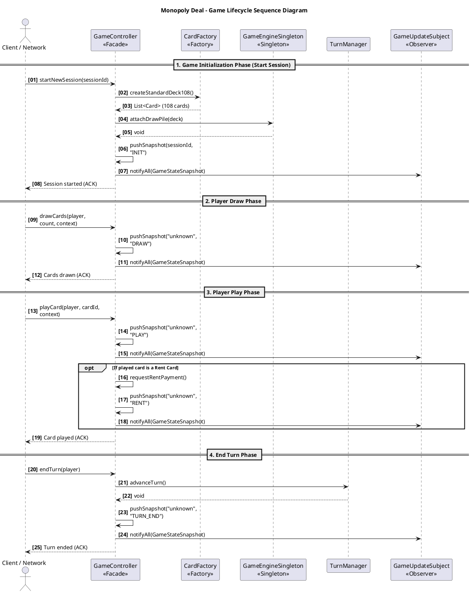
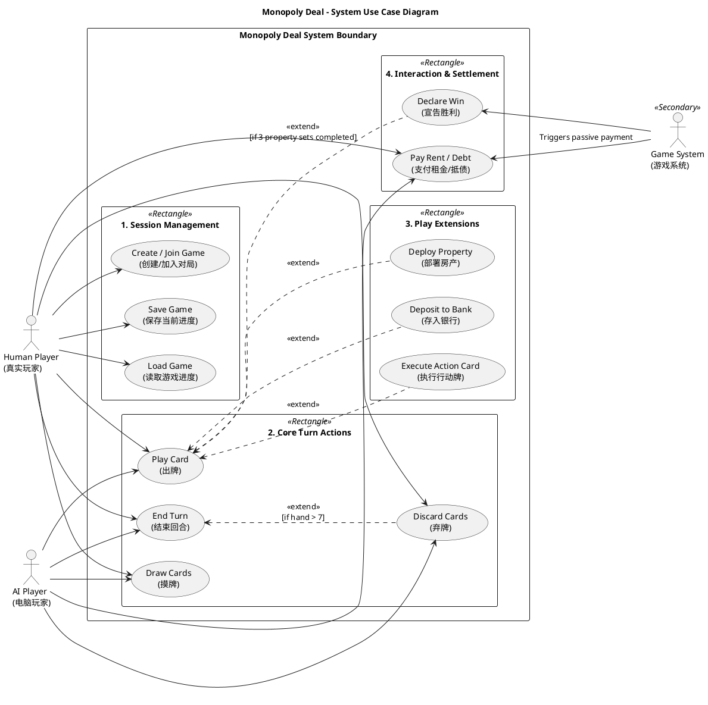

```plantuml
@startuml
skinparam classAttributeIconSize 0
skinparam linetype ortho
skinparam nodesep 60
skinparam ranksep 60
skinparam monochrome false
skinparam packageStyle rectangle

title Monopoly Deal Cards Game - Architecture Class Diagram

package "com.monopoly.model" #EBF4FA {
    interface Playable {
        + executeEffect(context: GameContext): void
    }
    interface Payable {
        + getFaceValue(): int
    }
    abstract class Card {
        - id: String
        - name: String
        - colorType: String
        + getId(): String
        + getName(): String
    }
    class PropertyCard extends Card implements Payable {
        - rentValues: int[]
        + getFaceValue(): int
    }
    class ActionCard extends Card implements Playable {
        - actionType: String
        + executeEffect(context: GameContext): void
    }
    abstract class Player {
        - playerId: String
        - handCards: List<Card>
        + drawCards(amount: int): void
        + playCard(card: Card): void
    }
    class HumanPlayer extends Player
    class AIPlayer extends Player
    class GameContext {
        - activePlayers: List<Player>
        - discardPile: List<Card>
        + getActivePlayers(): List<Player>
    }
}

package "com.monopoly.pattern" {
    package "strategy" #E8F8F5 {
        interface AiPlayStrategy {
            + determineNextMove(player: AIPlayer, context: GameContext): Card
        }
        class EasyAiPlayStrategy implements AiPlayStrategy
        class NormalAiPlayStrategy implements AiPlayStrategy
        class HardAiPlayStrategy implements AiPlayStrategy
    }
    AIPlayer *-- AiPlayStrategy : "uses >"
    package "factory" #FEF9E7 {
        interface CardFactory {
            + createStandardDeck(): List<Card>
        }
        class MonopolyDealCardFactory implements CardFactory
    }
    MonopolyDealCardFactory ..> Card : "<<creates>>"
    package "observer" #FDEDEC {
        interface GameUpdateObserver {
            + onGameStateUpdated(snapshot: GameStateSnapshot): void
        }
        interface GameUpdateSubject {
            + attach(obs: GameUpdateObserver): void
            + notifyAll(snapshot: GameStateSnapshot): void
        }
        class DefaultGameUpdateSubject implements GameUpdateSubject
    }
    DefaultGameUpdateSubject o-- GameUpdateObserver : "notifies >"
    package "singleton" #F5EEF8 {
        class GameEngineSingleton <<Singleton>> {
            - {static} instance: GameEngineSingleton
            + {static} getInstance(): GameEngineSingleton
        }
    }
}

package "com.monopoly.controller" #F4ECF7 {
    class TurnManager {
        - currentPlayerIndex: int
        + advanceTurn(): void
        + getCurrentPlayer(): Player
    }
    class GameController <<Facade>> {
        - turnManager: TurnManager
        - cardFactory: CardFactory
        - stateSubject: GameUpdateSubject
        + startNewSession(req): void
        + drawCards(player, count): void
        + playCard(player, card, actionType): void
        + endTurn(player): void
        + handlePlayActionRequest(req): void
    }
    class TurnFlowService <<package>> {
        - currentTurnPlayerId: String
        - currentTurnPhase: TurnPhase
        - currentTurnActionCount: int
        + drawCards(player, count): void
        + playCard(player, card, type, params): void
        + endTurn(player): Player
        + playActionCard(actor, card, ctx, params): ActionEffectResult
    }
    class EffectStackOrchestrator <<package>> {
        - responseScheduler: ScheduledExecutorService
        - pendingResponseFuture: ScheduledFuture
        + enterRentResponseWindow(tenant): void
        + performResponsePass(actingPlayerId): void
        + handleWaiverPlay(req): void
    }
    class AiTurnService <<package>> {
        + executeAiTurn(ai: AIPlayer): void
    }
    class RentSettlementService <<package>> {
        + requestRentPayment(from, to, amount, ctx): Result
        + collectRentForColor(landlord, tenant, colorKey): Result
    }
    class PauseVoteService <<package>> {
        - paused: boolean
        - pausePending: boolean
        + requestPause(): void
        + acknowledgePause(playerId): void
        + resume(): void
    }
    class SaveLoadService <<package>> {
        + exportSessionJson(): String
        + importSessionJson(json): void
        + maybeAutosaveAfterFullRound(rounds): void
    }
    class ProtocolErrors <<utility>> {
        + ERR_PLAY_REQUEST_EMPTY: String
        + ERR_PLAY_ACTION_TYPE_REQUIRED: String
    }
    GameController *-- TurnFlowService : "turn logic >"
    GameController *-- EffectStackOrchestrator : "effect stack >"
    GameController *-- AiTurnService : "AI turns >"
    GameController *-- RentSettlementService : "rent >"
    GameController *-- PauseVoteService : "pause >"
    GameController *-- SaveLoadService : "save/load >"
}

package "com.monopoly.dto" #FDEBD0 {
    class GameStateSnapshot
    class PlayActionRequest
    class StartSessionRequest
    class ActionParamContext
    class PropertyColorCount
}

package "com.monopoly.persistence" #D5F5E3 {
    class GameSessionMemento {
        + capture(controller): GameSessionMemento
        + applyToController(controller, memento): void
        + toJson(): String
        + {static} fromJson(json): GameSessionMemento
    }
    class SaveEncryption {
        + {static} encodeForStorage(json): String
        + {static} decodeFromStorage(encoded): String
    }
    class PersistedCard
    class SessionPlayerMemento
    class EffectStackEntryMemento
    class StackResponseStateMemento
}

package "com.monopoly.network" #FCF3CF {
    package "connection" {
        class ClientConnection
        class SessionRegistry
    }
    package "endpoint" {
        class MonopolyWebSocketEndpoint
        class WsServerMain
    }
    package "protocol" {
        class MessageDispatcher {
            + extractMessageType(json): String
            + parsePlayActionRequest(payload): PlayActionRequest
        }
    }
    class GameServer implements GameUpdateObserver {
        + onMessage(from, json): void
        + onClientConnected(client): void
    }
}

GameEngineSingleton *-- GameController
GameController *-- TurnManager : "composes >"
GameController --> DefaultGameUpdateSubject : "triggers >"
GameController --> CardFactory : "uses >"
GameServer *-- ClientConnection : "manages >"
GameServer --> MessageDispatcher : "routes msg >"
MessageDispatcher --> GameController : "calls API >"
SaveLoadService ..> GameSessionMemento : "uses >"
SaveLoadService ..> SaveEncryption : "uses >"
@enduml
```

# UML Source Documentation

This document consolidates UML-related sources into a single location.
Note: Some source comments are bilingual (English/Chinese) because they were originally authored that way.

## Class Diagram

Purpose: Describe the core architecture, model/controller/network boundaries, and major pattern relationships.

PlantUML source:



Image:


## Sequence Diagram

Purpose: Describe the session lifecycle from session start through draw/play/end-turn and snapshot broadcasting.

PlantUML source:



Image:


## Use Case Diagram

Purpose: Describe human/AI/system actor interactions and include/extend relationships for gameplay actions.

PlantUML source:



Image:


## Package Structure Summary

Refactored package layout after the controller service-extraction and DTO/persistence/network reorganization.

```
com.monopoly
├── controller/                     # 【Facade + 内聚服务层】
│   ├── GameController.java         # Facade — 纯粹的 API 组装与委托
│   ├── TurnManager.java            # 回合顺序管理
│   ├── TurnFlowService.java        # 回合流程核心（摸牌/出牌/弃牌/结束回合/行动卡）
│   ├── EffectStackOrchestrator.java # 效果栈编排 & 响应超时定时器
│   ├── AiTurnService.java          # AI 回合执行
│   ├── RentSettlementService.java   # 租金结算
│   ├── PauseVoteService.java        # 暂停 / PVP 投票
│   ├── SaveLoadService.java         # 存档 / 读档 / 自动保存
│   └── ProtocolErrors.java          # 协议级错误码 & ProtocolValidationException
│
├── dto/                             # 数据传输对象（原 model.dto → 顶层 dto 包）
│   ├── GameStateSnapshot.java
│   ├── PlayActionRequest.java
│   ├── StartSessionRequest.java
│   ├── ActionParamContext.java
│   └── PropertyColorCount.java
│
├── model/                           # 领域模型
│   ├── Card, ActionCard, PropertyCard, MoneyCard, PropertyWildCard ...
│   ├── Player, HumanPlayer, AIPlayer
│   ├── GameContext, GameConstants
│   ├── EffectStackEntry, EffectStackResolver, StackResponseState
│   ├── PaymentSettlement, RentCalculator, PropertySetCalculator
│   ├── Playable, Payable
│   └── effects/                     # 行动卡效果策略
│       ├── ActionEffectDispatcher
│       ├── ActionEffectContext / ActionEffectResult
│       └── RentEffect, DoubleRentEffect, ...
│
├── persistence/                     # 存档持久化（原 model.persistence → 顶层 persistence 包）
│   ├── GameSessionMemento.java      # 完整对局快照 Memento（反射捕获/恢复）
│   ├── SaveEncryption.java          # Base64 编解码
│   ├── PersistedCard.java
│   ├── SessionPlayerMemento.java
│   ├── EffectStackEntryMemento.java
│   └── StackResponseStateMemento.java
│
├── network/                         # 网络层
│   ├── GameServer.java              # WebSocket 服务端 + 观察者
│   ├── connection/                  # 连接管理
│   │   ├── ClientConnection.java
│   │   └── SessionRegistry.java
│   ├── endpoint/                    # WebSocket 容器端点
│   │   ├── MonopolyWebSocketEndpoint.java
│   │   └── WsServerMain.java
│   └── protocol/                    # 消息协议
│       └── MessageDispatcher.java
│
└── pattern/                         # 设计模式基础设施
    ├── factory/     CardFactory, MonopolyDealCardFactory
    ├── observer/    GameUpdateSubject, GameUpdateObserver, DefaultGameUpdateSubject
    ├── singleton/   GameEngineSingleton
    └── strategy/    AiPlayStrategy, EasyAi/NormalAi/HardAiPlayStrategy, AiHeuristics
```

### Design Rationale

| Change | Motivation |
|--------|-----------|
| `GameController` → pure Facade | SRP：将 1300+ 行 God Class 拆分为 6 个 ≤300 行的内聚服务 |
| `TurnFlowService` | 拥有回合状态（phase / actionCount），封装摸牌→出牌→弃牌→结束回合主循环 |
| `EffectStackOrchestrator` | 隔离 `ScheduledExecutorService` 与 `volatile ScheduledFuture` 并发逻辑 |
| `AiTurnService` | AI 决策循环独立，通过 `AiGameBridge` 复用人类玩家相同的校验链路 |
| `dto/` 升顶层 | DTO 不属于领域模型，减少 `model` 包膨胀 |
| `persistence/` 升顶层 | 序列化/反射逻辑与领域对象解耦 |
| `network/` 子包化 | connection / endpoint / protocol 三个关注点物理隔离 |
