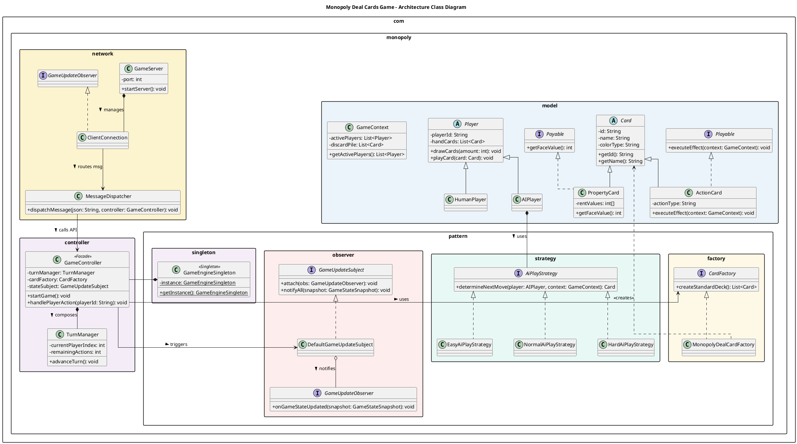
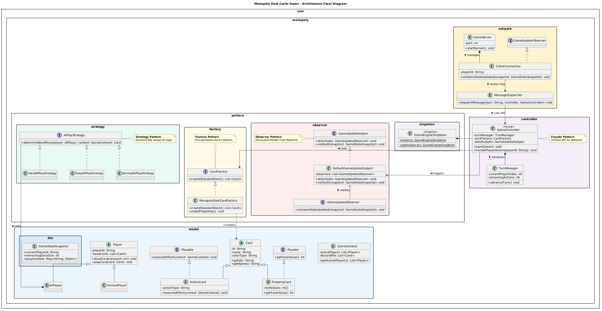
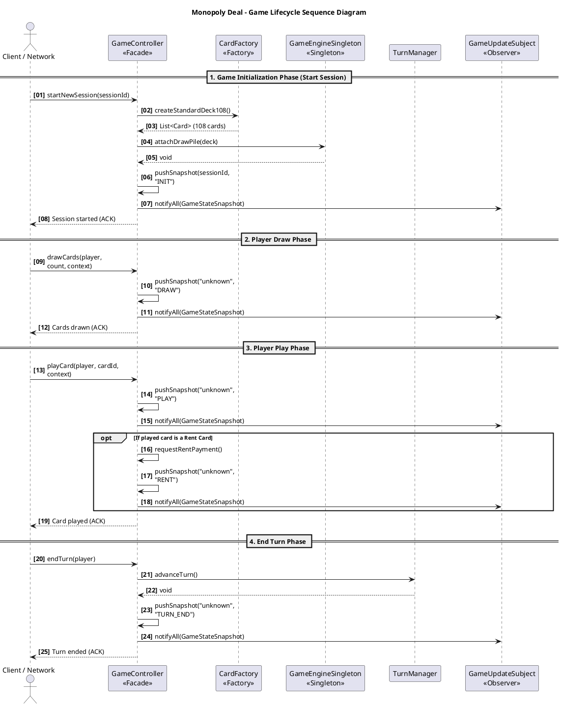
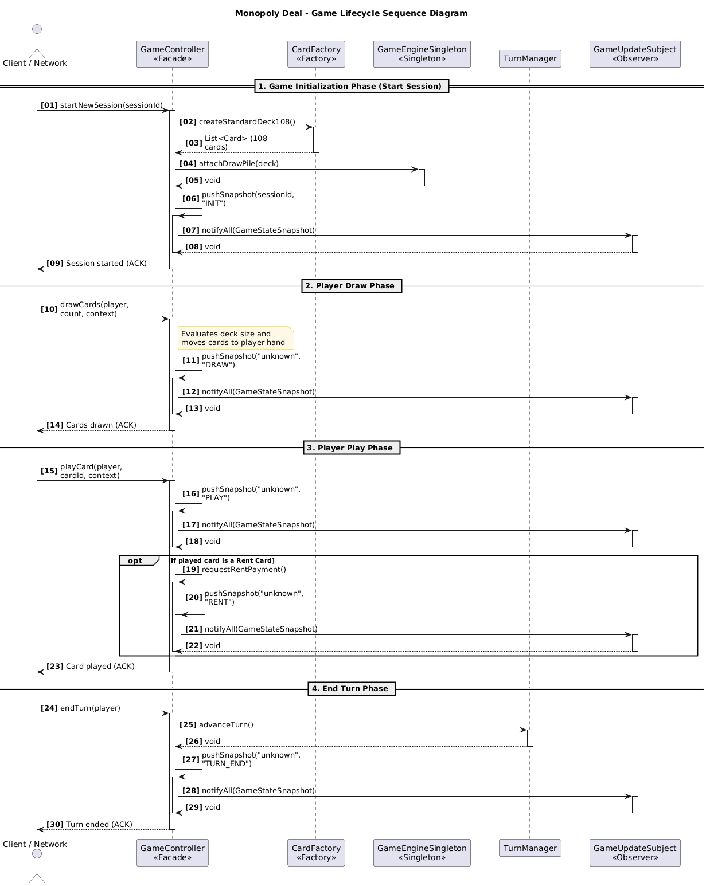
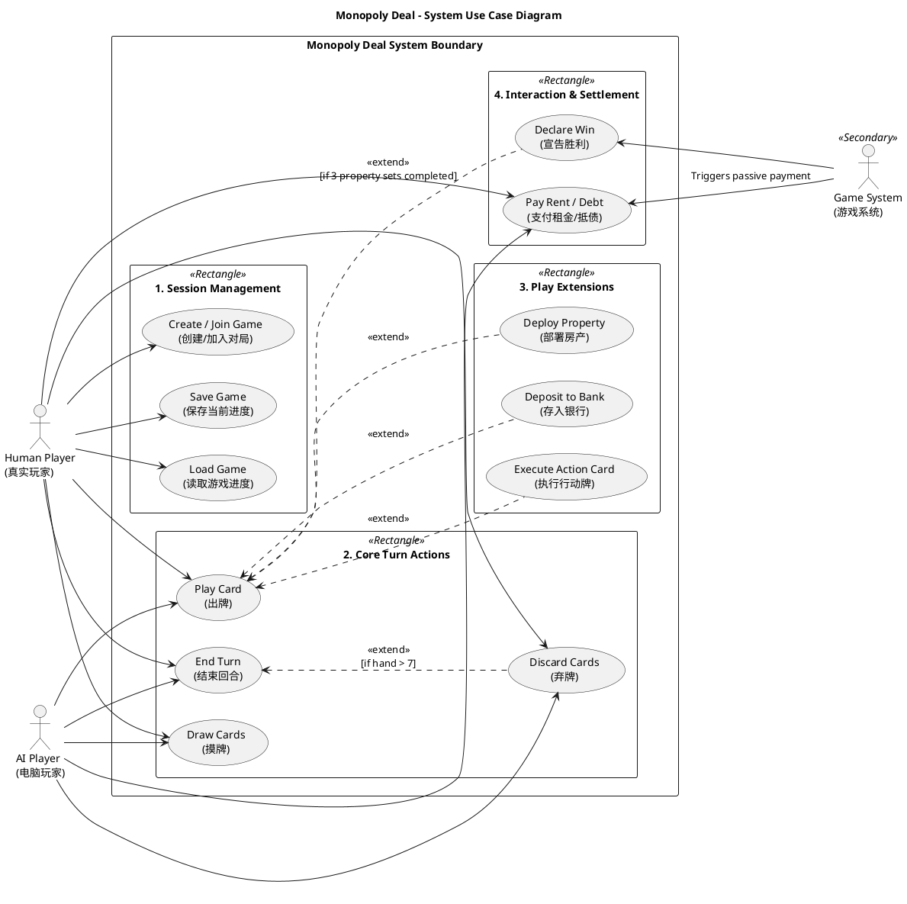
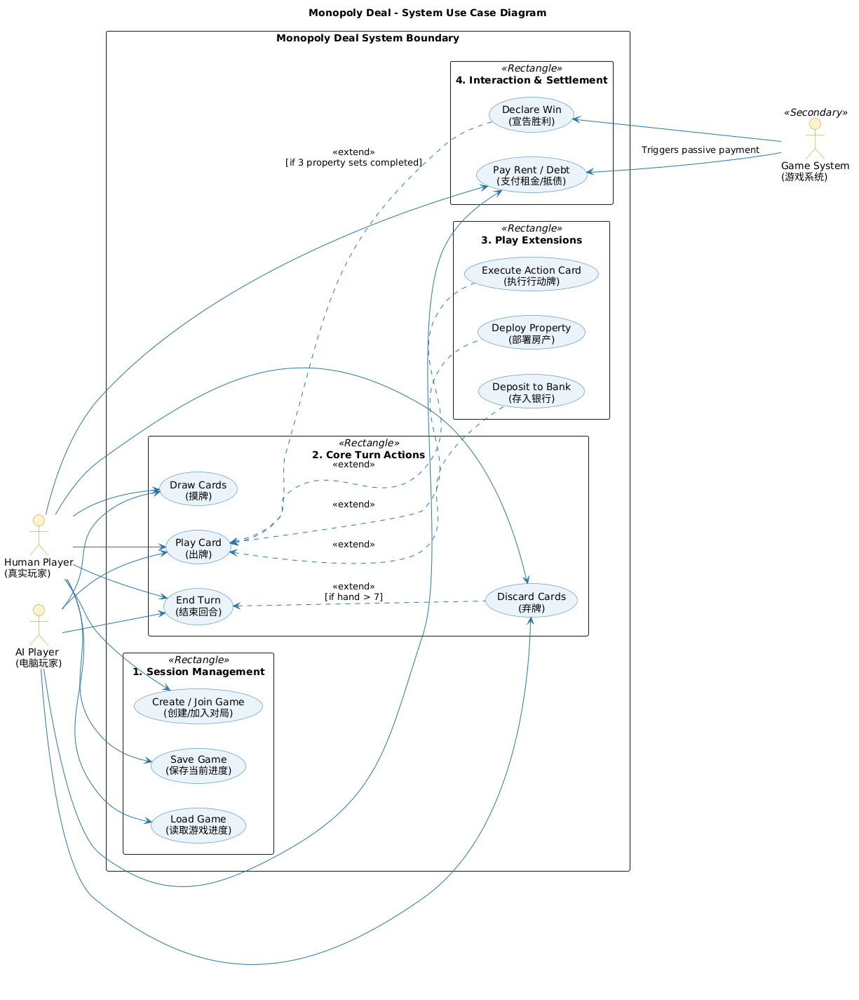

# UML Source Documentation

This document consolidates UML-related sources into a single location.
Note: Some source comments are bilingual (English/Chinese) because they were originally authored that way.

## Class Diagram

Purpose: Describe the core architecture, model/controller/network boundaries, and major pattern relationships.

PlantUML source:

Image:

## Sequence Diagram

Purpose: Describe the session lifecycle from session start through draw/play/end-turn and snapshot broadcasting.

PlantUML source:

Image:

## Use Case Diagram

Purpose: Describe human/AI/system actor interactions and include/extend relationships for gameplay actions.

PlantUML source:

Image:

